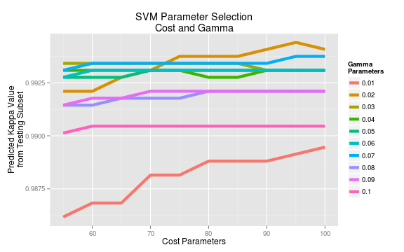

Practical Machine Learning Course Project
-----------------------------------------
by Brian Morge  

# Executive Summary
The project is exploring the use of machine learning for human activity
recognition.  The dataset is contains data from 6 participants performing
Unilateral Dumbbell Biceps Curls in 5 different fashions.  The goal is the
determine if the proper technique can be discerned from 4 classes of common
mistakes in technique.  Sensors were attached to subjects arms, forearms, belts,
and the dumbell.  For this purpose machine learning algorithms utilizing support
vector machines (SVMs) were trained on the dataset and assessed against the 5
known classes of dumbbell biceps curls as intended in the experiment design. 
The final SVM model was able to obtain strong predictive accurancy on all 5
classes of the excercise.

# Methodology and Approach

Support Vector Machines, SVMs, are supervised learning models that can be used for classification and regression analysis.  The kernel of a SVM determines how the model behaves.  The SVM used is this analysis used the Radial Basis Function Kernel, which in effect converts each training data point into a training variable.  Each training case using the Radial Basis Frunction is compared each other point in the training data.  This is how it creates non-linear classification boundaries.  Detailed discussion of SVMs is available from many sources including Wikipedia (see references).

## Variable Selection
  
The source data had 159 variables including labeling variables such as 3
timestamp variables, a user name variable, a 2 variables on window referening to
the exercise repitition number.  I removed all the labeling variables as my goal
was to determing the instantaneous exercise class without knowing who is
performing it, when, and without timeseries information.  
  
Then after looking at the data it became apparent that there were a large number
of variables with mostly NA values.  I calculated the quantity of NA values plus
blanks for each variable.  The results showed that there were 100 variables that
were NA or blank for exactly 19216 rows.  And contained actual values for just
406 rows.  There rows contained summary information such as maximum, mininimum,
avgerage, variance, standard deviation, amplitude, etc. for the other statistics
over the exercise windows.  The remaining 59 variables had zero blanks on NAs. 
The rows 406 summary rows and the 100 summary variables were removed from the
data set.  The remaining variables were all instantaneous sensor data or derived
from sensor data for each observation.  
  
After narrowing down the dataset to 59 variables. A SVM model was trained and it
performed well, over 90% accuracy.  Further reduction of variables was put off
while refining the SVM input parameters: cost and gamma.  The final model
predicted Kappa and Accurancy levels above 0.99 so further reduction of
variables was not performed.  
  

## Training and Testing Models

The provided training data contained 19216 rows after data cleaning was performed.  In order to test various model parameters and at the end assess model accuracy that data was split into 3 sets of data.
 - 60%: Training Set
 - 20%: Test Set
 - 20%: Validation Set  
  
In each iteration the individual models were trained against the training set
and the kappa and accuracy values were calculated by predicting the outcomes on
the test set.  The final SVM model was the only model that performed predictions
on the Validation set, in order to develop an accuracy measurement in model
generalization.  
  
The `caret` package function `createDataPartition()` was used in seperating out
the 3 data sets so that a representative portion of each exercise classe were
available.  Using built in R sampling functions this will not in general be the
case, but with 19216 data points it is possible that the results while not as
good could have still be acceptible.

## Support Vector Machine: Parameter Selection

The two parameters needed to train the SVM model are _cost_ and _gamma_.  
  
The _cost_ parameter determines the about of regularization that occurs the SVM model.  A higher cost parameter increases the variance in the model and decreases the model regularization.  
The _gamma_ parameter determines the radius of the SVM kernel, the Radial Basis Function.  A higher gamma corresponds to a smaller radius for the kernel.  gamma has an inverse relationship the variance and standard deviation.  The Radial Basis Function is sometimes referred to as the Gausian Kernel.  
  
The cost and gamma coefficients were assessed based on the model's overall Kappa coefficient and Accuracy for various configurations.  Two rounds of parameters were assessed first over a wide range, and next at closer range to narrow in on the final model's paramters.  
The first set of parameters explored were:
 - *Cost:*    5, 10, 20, 80, 160, 320, 640
 - *Gamma:*   0.01, 0.02, 0.04, 0.08, 0.16, 0.32  
  
The second set of paramters explored were:  
 - *Cost:*    55, 60, 65, 70, 75, 80, 85, 90, 95, 100
 - *Gamma:*   0.01, 0.02, 0.03, 0.04, 0.05, 0.06, 0.07, 0.08, 0.09, 0.10  
  
The best performing parameters were found to be gamma at 0.02 and cost at 95.

 
  
*Figure 1:* Graph of Results from Model Comparisons Using Test Data Set  
  

# Support Vector Machine: Final Model

The final SVM model was trained using 60% of the dataset.  The parameters cost =
95 and gamma = 0.02 were selected based on the model's Kappa value on the test
set (20% of the data) and the prediction accuracy was assessed at over 99% using
the validation set (20% of the data).  The Confusion Matrix function,
`confusionMatrix()`, for the `caret` package calculaes the accuracy confidence
interval between 0.9898 and 0.9954.  It was this also used to predict the
seperate "test set" in 'pml-testing.csv' and corrrectly predicted each case. 
The following tables summarize its performance on the validation dataset.  
  
  
      Accuracy          Kappa  AccuracyLower  AccuracyUpper AccuracyPValue 
         0.993          0.991          0.990          0.995          0.000 

|                     | Class: A| Class: B| Class: C| Class: D| Class: E|
|:--------------------|--------:|--------:|--------:|--------:|--------:|
|Sensitivity          |    0.999|    0.988|    0.990|    0.987|    0.997|
|Specificity          |    0.997|    0.999|    0.997|    0.998|    1.000|
|Pos Pred Value       |    0.993|    0.995|    0.988|    0.990|    0.999|
|Neg Pred Value       |    1.000|    0.997|    0.998|    0.998|    0.999|
|Prevalence           |    0.285|    0.193|    0.174|    0.164|    0.184|
|Detection Rate       |    0.285|    0.191|    0.173|    0.162|    0.183|
|Detection Prevalence |    0.287|    0.192|    0.175|    0.163|    0.183|
|Balanced Accuracy    |    0.998|    0.993|    0.994|    0.993|    0.998|
  
*Figure 2:* Final Model Statistics by Classe  
  

# References
 - Dataset link: http://groupware.les.inf.puc-rio.br/har#weight_lifting_exercises
 - Video describing usage of these types of sensors https://www.youtube.com/watch?v=meNf1b1yY0Y
 - SVMs on Wikipedia: https://en.wikipedia.org/wiki/Support_vector_machine
 - Chang, Chih-Chung and Lin, Chih-Jen:  
LIBSVM: a library for Support Vector Machines  
http://www.csie.ntu.edu.tw/~cjlin/libsvm  

## Original Data Set Source

### Qualitative Activity Recognition of Weight Lifting Exercises
> Velloso, E.; Bulling, A.; Gellersen, H.; Ugulino, W.; Fuks, H. Qualitative Activity Recognition of Weight Lifting Exercises. Proceedings of 4th Augmented Human (AH) International Conference in cooperation with ACM SIGCHI (Augmented Human'13) . Stuttgart, Germany: ACM SIGCHI, 2013.

Read more: http://groupware.les.inf.puc-rio.br/work.jsf?p1=11201#ixzz3diXyRfUu  
## License
> Important: you are free to use this dataset for any purpose. This dataset is licensed under the Creative Commons license (CC BY-SA). The CC BY-SA license means you can remix, tweak, and build upon this work even for commercial purposes, as long as you credit the authors of the original work and you license your new creations under the identical terms we are licensing to you. This license is often compared to "copyleft" free and open source software licenses. All new works based on this dataset will carry the same license, so any derivatives will also allow commercial use.

